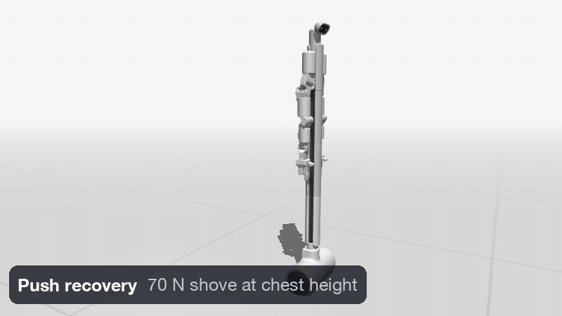
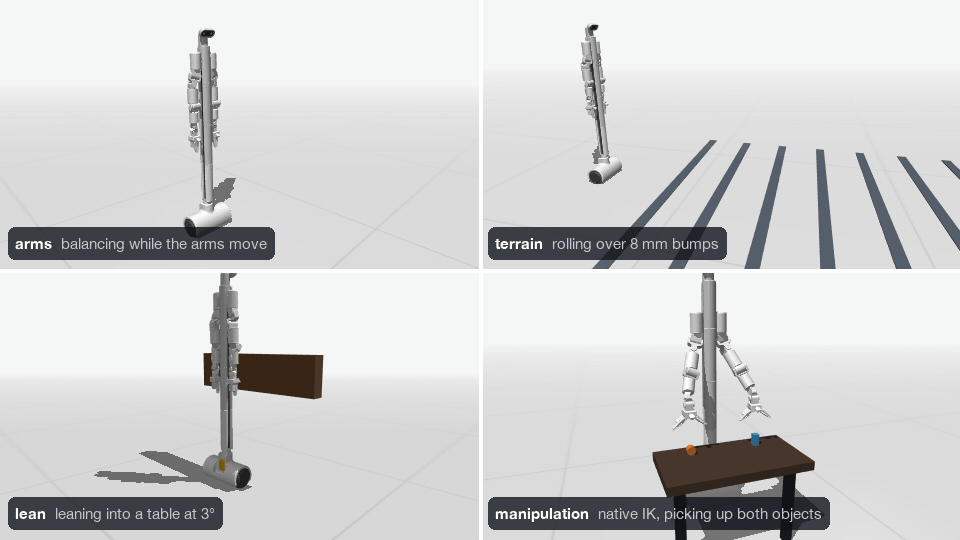

<div align="center">

# bb-sim

**Drive BracketBot's balance and manipulation policies in MuJoCo, no robot required.**

[](https://www.python.org/downloads/) [](https://mujoco.org/) [](https://github.com/astral-sh/uv) [](#requirements)



</div>

bb-sim runs BracketBot's arms, terrain, and lean balance policies against a MuJoCo model built from the robot's CAD. The wheels use a learned motor model and the same Hall-encoder velocity estimate the policies were trained with. The model, meshes, and ONNX policy weights are all in this repo, so it runs offline with no robot connection.

## Quickstart

Install [Git](https://git-scm.com/downloads) and [uv](https://docs.astral.sh/uv/getting-started/installation/), then:

```sh
git clone https://github.com/Bracket-Bot-Inc/bb-sim.git
cd bb-sim
uv run bbsim arms
```

The first run installs Python 3.12 and the locked dependencies automatically.

## Modes

<div align="center">

</div>

| Mode | What it does | Command |
| --- | --- | --- |
| `arms` | Balance policy that handles moving arms. **M** toggles a reach demo. | `uv run bbsim arms` |
| `terrain` | Balance on flat ground, low bumps, or a 3° slope. Arms stay at the training pose. | `uv run bbsim terrain --terrain bumps` |
| `lean` | Lean into a table edge at 1–15°. **L** toggles the table; **[** and **]** change the angle. | `uv run bbsim lean` |
| `manipulation` | Fixed base with the native IK solver. Grab the block or the cylinder. | `uv run bbsim manipulation` |

## Controls

**Driving** (`arms`, `terrain`, `lean`)

| Key | Action |
| --- | --- |
| Hold **W** **A** **S** **D** | Drive and turn; release to stop |
| **Space** | Stop |
| **R** | Reset |
| **P** | Pause |
| **M** | Toggle arm motion (`arms`) |
| **L** | Toggle table lean (`lean`) |
| **[** / **]** | Lower / raise the lean angle (`lean`) |
| Mouse drag / scroll | Orbit / zoom the camera |
| **Esc** | Close |

**Manipulation**

| Key | Action |
| --- | --- |
| Arrow keys | Move the hand target in X / Y |
| **Page Up** / **Page Down** | Move the hand target in Z |
| **Tab** | Switch arm |
| **Space** | Open / close the gripper |
| **F** | Toggle the hand camera |
| **P** / **R** / **Esc** | Pause / reset / close |

You can also type exact hand positions and wrist angles in the side panel.

## Headless runs

The drive modes also run without a window, for quick checks and scripting:

```sh
uv run bbsim terrain --terrain slope --headless --duration 5 --report outputs/report.json
```

Useful flags: `--velocity` and `--yaw` set the command, `--start-pitch` starts the robot tilted, `--ideal-wheels` skips the Hall estimator, `--screenshot` saves the last frame, and `--trace` saves 200 Hz state, observation, and action arrays. The process exits with code 2 if the robot falls. Run `uv run bbsim --help` for every option.

## Requirements

- Tested on macOS with Apple Silicon. The windowed UI and `--screenshot` need OpenGL; other headless runs don't.
- `manipulation` loads a native IK library that's bundled only for Apple Silicon macOS (`assets/ik/darwin-arm64`). On other platforms, build it from a `bracketbot_ik` checkout with `uv run python scripts/build_ik.py /path/to/bracketbot_ik`, or pass `--ik-library`.

## What's in the repo

```text
bbsim/     simulator, policy runner, observation builder, and viewers
assets/    MJCF scenes, CAD meshes, ONNX policies, wheel motor models, IK library
scripts/   build_ik.py (rebuilds the native IK library)
docs/      README GIFs and the GitHub social preview
```

---

<div align="center">
Built by <a href="https://bracketbot.com">Bracket Bot</a>
</div>
